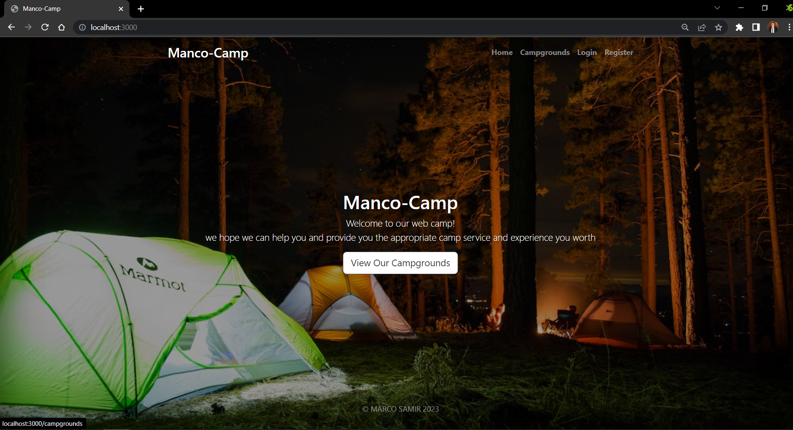
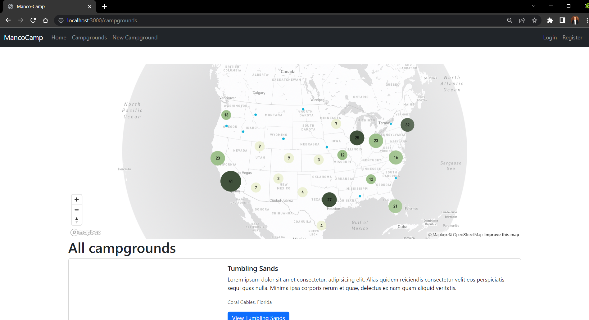
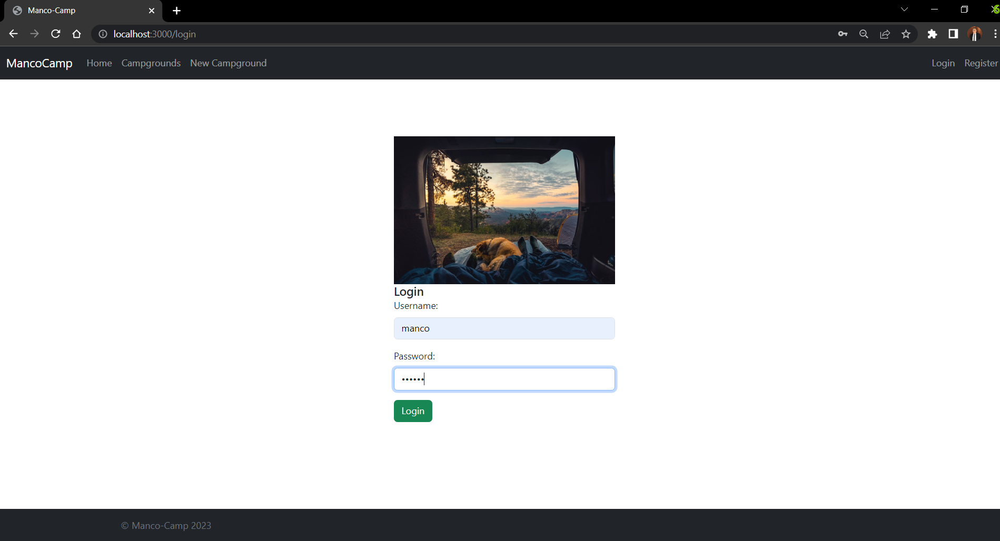
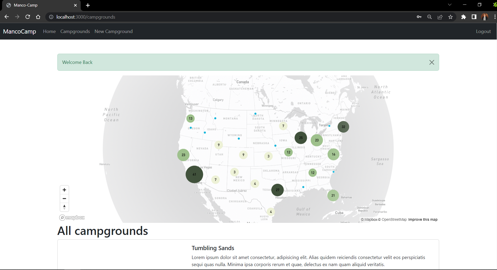
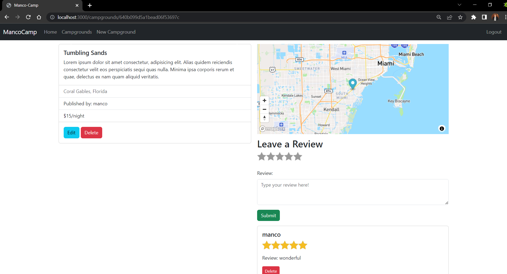
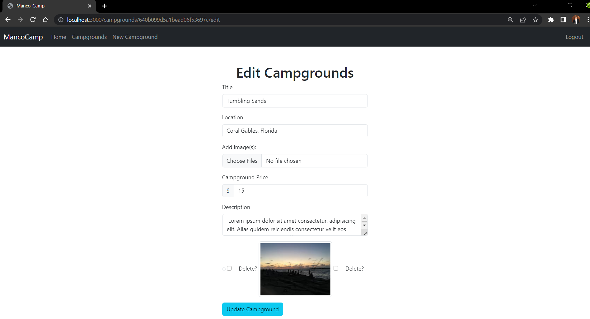
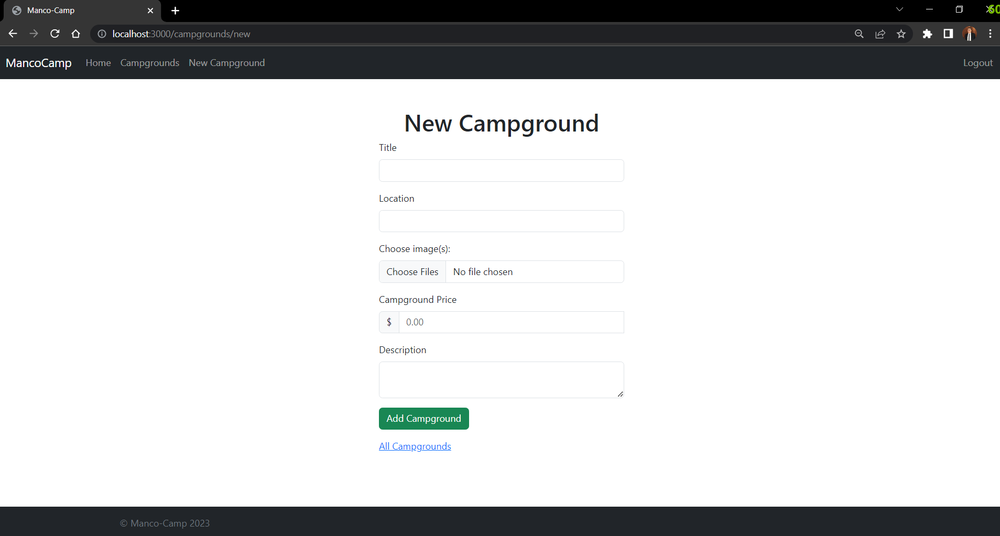
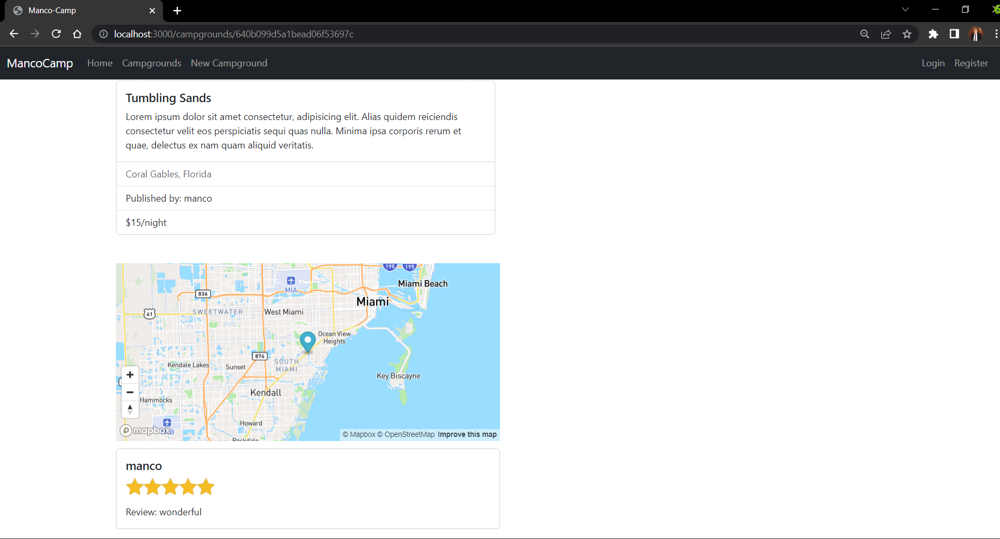

## Manco-Camp
Camp management web application that contains all camp-grounds in the USA with location, owner, price, rating, reviews and gallery for each camp allowing potential customers to interact with owners through a powerful commenting system, using Node.js, JavaScript, Mongoose, Express, Mapbox, Passport (Authentication and Authorization), Helmet, CSS & Bootstrap.

# -Stunning landing page

# -powerfull geolocation system

# -Fully Secured

# -efficient campgrounds management

# -Beutiful highly detailed campgrounds

# -Advanced CRUD opertions

# -Genuine reviewing system

